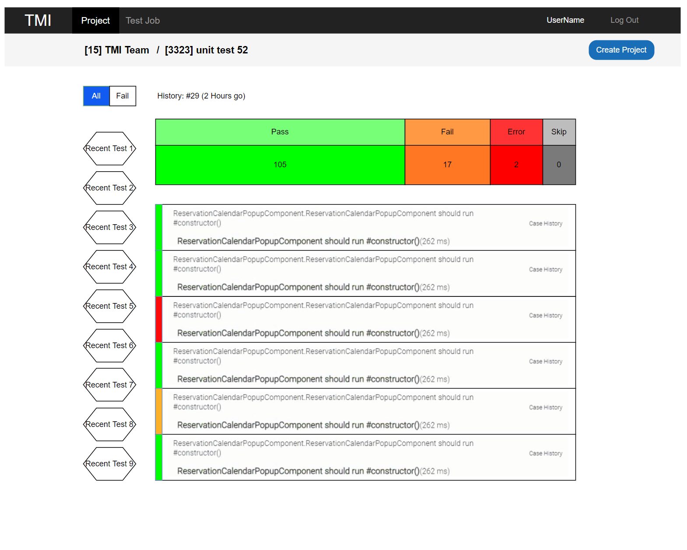
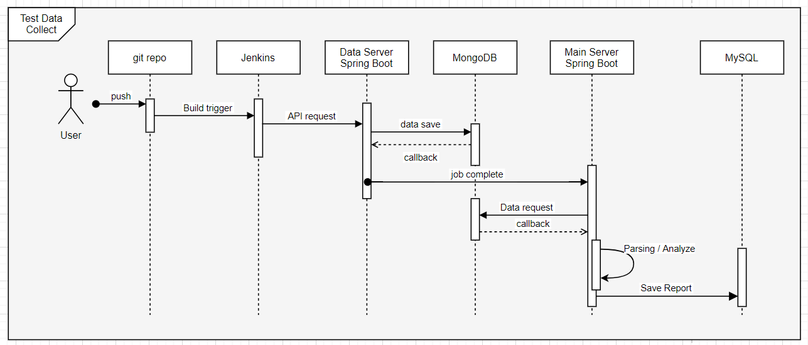
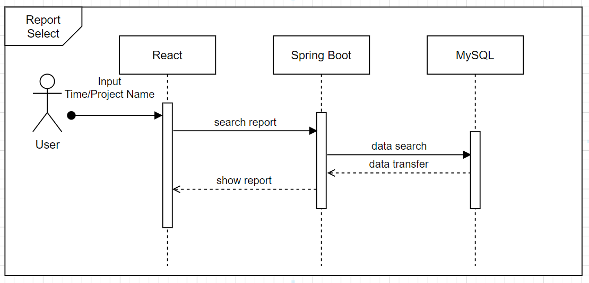

# TMI ( Test automation Management Infrastucture )

<br>
<br>
<br>

## SSAFY X SAMSUNG SDS (기업연계 프로젝트)

<br>

[TMI Notion](https://www.notion.so/longnh214/d13c839d33b94377b138427b4d743a7a?v=4ba79c8783a9492c864e3f640ead7cde)

<br>
<br>

## 프로젝트 개요
- **진행기간** : 2021.04.12 ~ 2021.05.21
- **만든이** : 강세준, 김영록, 백현오, 이병희, 전원표, 최낙훈
- **기획 배경** : 
  - 테스트 자동화란, 테스트 과정 일부 또는 전체를 수작업이 아닌 자동화된 프로그램을 통해서 수행하는 기법
  - 현업에서는 이런 테스트 자동화를 거치고 난 후에 배포가 이뤄짐

<br>
<br>


## Wireframe





<br>


## Architecture


<br>


## Sequence Diagram




<br>

## Milestone


<br>
<!-- ## Document -->

## ERD Diagram


<br>
<br>


## Tech Stack


<br>


## Capture Image

### 프로젝트 목록


### 프로젝트 내 App 목록


### App history 화면


### Unit Test 결과


### 커버리지 상세 화면 및 클래스 별 커버리지 화면


<br>


# Build Guideline


## Plug-in

### 

### Maven Project

* Path : `/backend/tmi-maven-plugin`


```
mvn clean package
```


* 빌드 이후에 나온 jar 파일을 확인하고 싶은 프로젝트 아래 lib 폴더에 저장


## Main Server


### Spring Project

* Path : `/backend/TmiProject`

```shell
mvn clean package
cd target
nohup java -jar *.jar &
```


## Data Server


### Spring Project

* Path : `/backend/TMI`

```
mvn clean package
cd target
nohup java -jar *.jar &
```


## Frontend React

* Path : `/frontend`

```shell
npm i
npm run build
```
